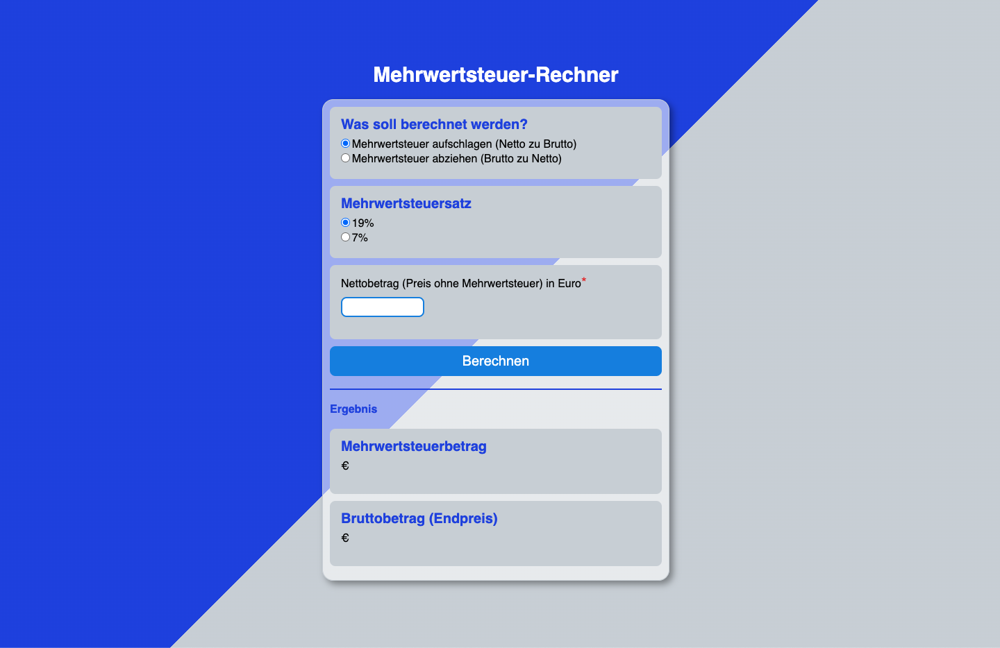

# Value Added Tax Calculator

This is a calculator designed to calculate value-added tax, net amount, and gross amount when shopping in Germany. There are two VAT rates in Germany: 19% and 7% (for certain products). This app enables calculations from net to gross and vice versa.

## Table of contents

- [Overview](#overview)
  - [Screenshot](#screenshot)
  - [Links](#links)
- [My process](#my-process)
  - [Built with](#built-with)
  - [What I learned](#what-i-learned)
  - [Continued development](#continued-development)
  - [Useful resources](#useful-resources)
- [Author](#author)

## Overview

### Screenshot

#### Desktop:

### Links

- Solution URL: [index.html](https://github.com/wilhelm-lenz/value-added-tax-calculator/blob/main/index.html)
- Solution URL: [style.css](https://github.com/wilhelm-lenz/value-added-tax-calculator/blob/main/assets/css/style.css)
- Solution URL: [main.js](https://github.com/wilhelm-lenz/value-added-tax-calculator/blob/main/assets/js/main.js)
- Live Site URL: [value-added-tax-calculator](https://wilhelm-lenz.github.io/value-added-tax-calculator/)

## My process

### Built with

- Semantic HTML5 markup
- SCSS custom properties
- JavaScript

### What I learned

I learned how to approach a project like this, how to plan it, and what challenges the HTML structure can present. It's crucial to proceed in a structured manner and not to use too many wrapping elements. However, these elements sometimes make later design work easier. In this project, I wrote the JavaScript code directly after the HTML, before beginning the design. In future projects, I will make sure to create at least a basic design to have a better overview of the data output via JavaScript. I found this approach personally more manageable.

### Continued development

In the next phase, I will first revise the project in terms of HTML and CSS to solve the bugs that have come to my attention. Additionally, I want to create a better-structured and more semantic HTML. The application will also be built as an app with Netlify, which is why the calculator will likely take up the entire viewport.

### Useful resources

- Netlify - [@app.netlify](https://app.netlify.com/drop/) [@netlify](https://netlify.com): Netlify is a development platform that allows you to scale a web application. For instance, a programmed web application can easily be turned into a mobile web app.

## Author

- Wilhelm Lenz - [@wilhelm-lenz](https://github.com/wilhelm-lenz)
